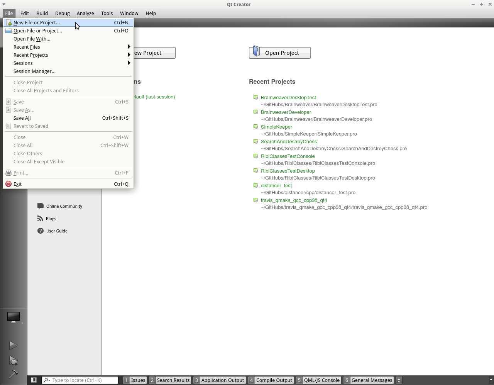

# Introduction

This is `Testing C++ Qt GUI applications', version 0.1, a tutorial about testing C++ GUI applications written with Qt.

For now, I only consider Qt applications under GNU/Linux, as I use 'xdotool' to manipulate windows.

Goal is to reliably test Qt GUI applications.

## Qt

Qt is a cross-platform C++ library to create GUIs.

##  xdotool

xdotool is a GNU/Linux command-line tool.

##  Travis CI

Travis CI is a continuous integration (hence the 'CI') tool.

## Screenshots

I think it is important to use screenshots.
I do sometimes modify these for clarity. 
Usually this involves sliding things together:

