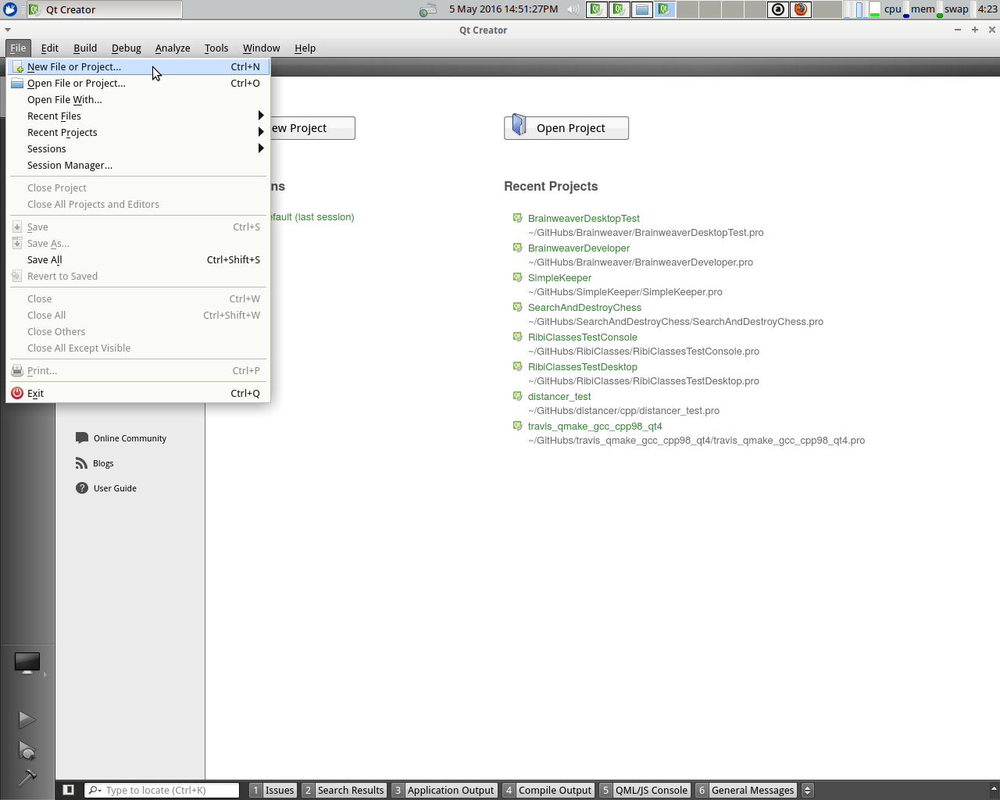
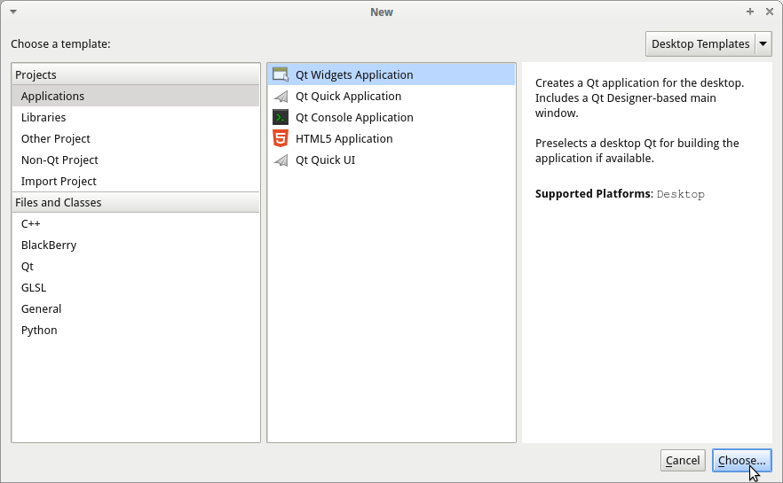
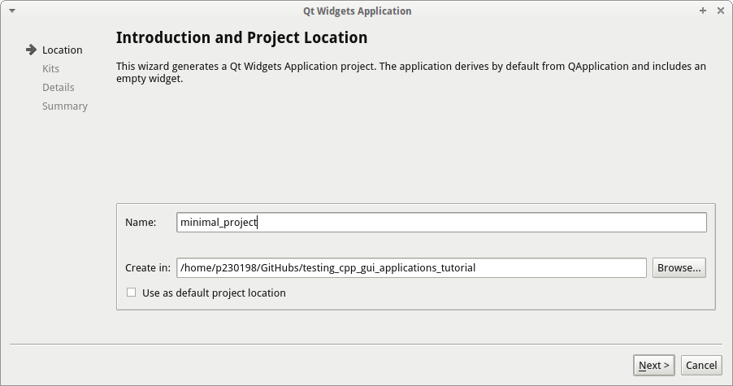
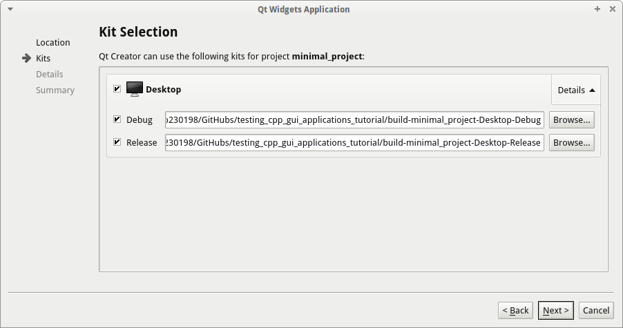
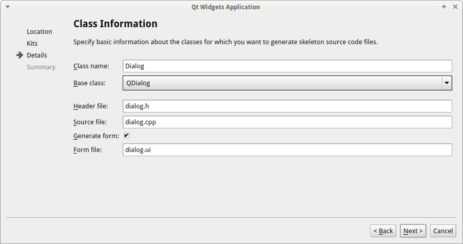
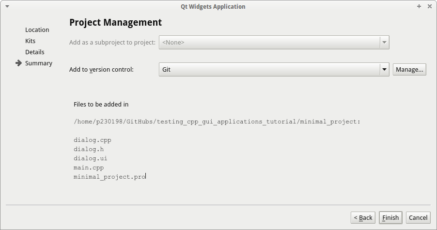
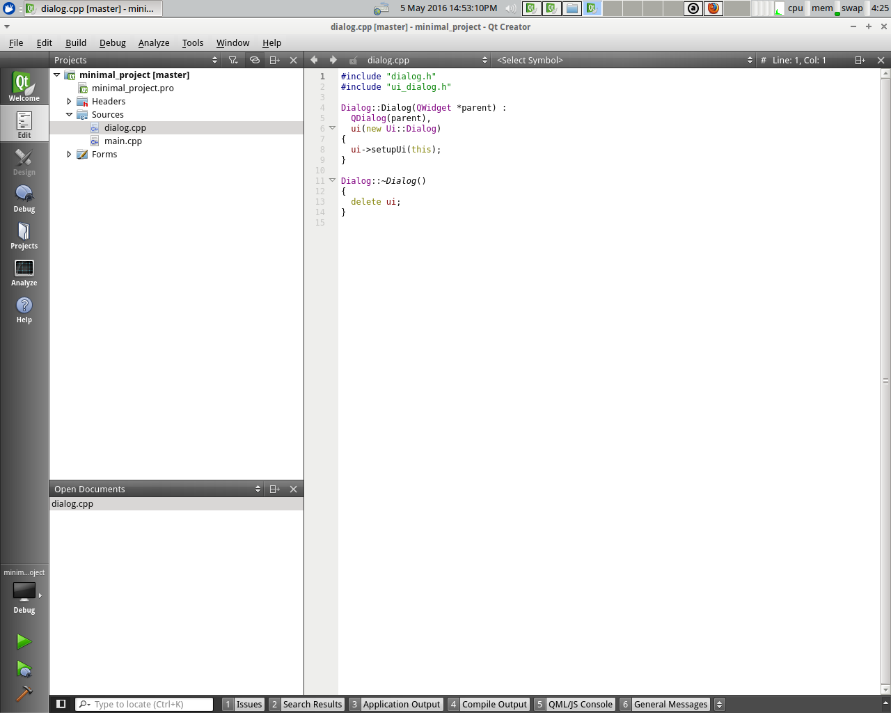
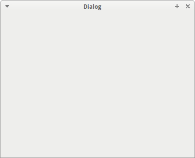

# Minimal project

Setting up a minimal project consists out of these steps:
 * Creating a minimal Qt application
 * Testing the minimal Qt application

## Creating a minimal Qt application

Create a new Qt Creator project, by clicking from the Qt Creator menu 'File | New File or Project'.

In the 'New' dialog, select 'Qt Widgets Application' and click 'Choose'.

In the 'Qt Widgets Application' dialog, pick a suitable location to put the files of your project.

In the next 'Qt Widgets Application' dialog, just use the default kits by clicking 'Next'.

In the next 'Qt Widgets Application' dialog, use 'QDialog' as the base class. Use all default names by clicking 'Next'.

In the next 'Qt Widgets Application' dialog, skip this way of using git to do version control by clicking 'Finish'.

Now, your minimal project is created.

Now run the application, by either pressing CTRL+R, selecting 'Build | Run' from the Qt Creator menu, or click the green arrow on the left. The minimal application is an empty dialog.

## Testing this minimal Qt application

Instead of using the low-level xdotool commands as described in chapter [subsec:xdotool-tutorial], 
the minimal Qt application bash testing script is tested with higher-level functions:

[minimal_project.sh](minimal_project.sh)

Listing: minimal_project.sh (summary)

It opens the application, closes it by using ALT-F4, re-starts the application, then closes it by using the mouse.

Note that this scripts is stripped down to fit on one page. 

[minimal_project_complete.sh](minimal_project_complete.sh)

Listing: minimal_project_complete.sh
